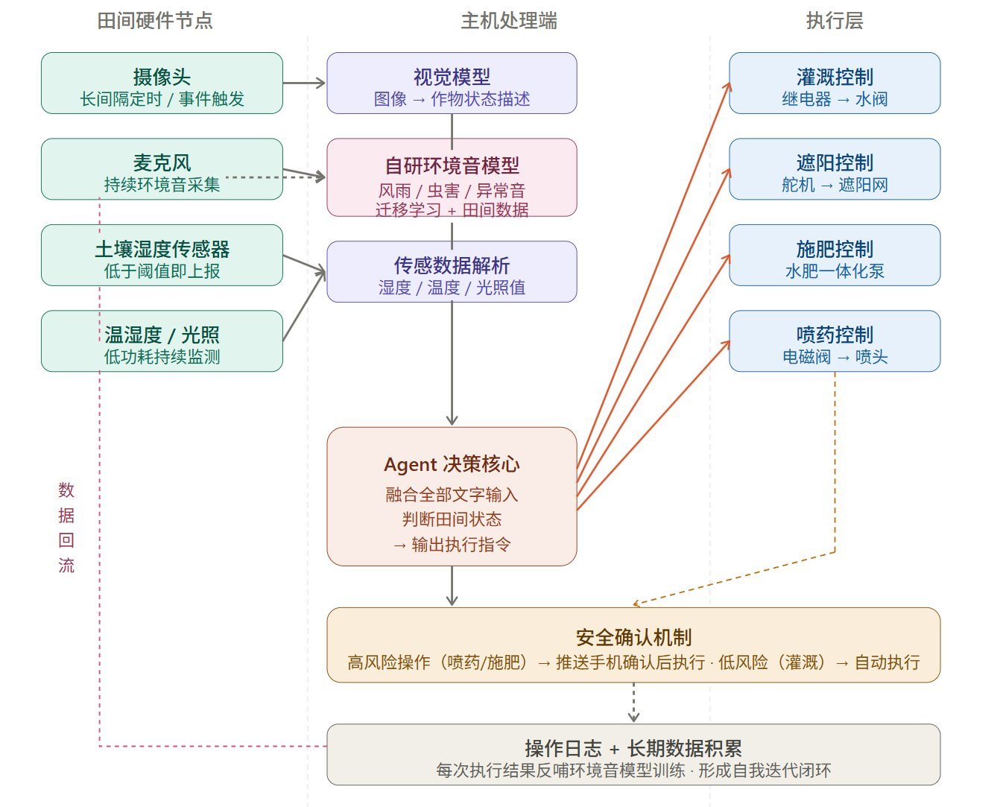

# 农业田间智能感知与执行系统

> 低成本、全本地部署的农业田间智能系统——从多传感器感知、自研深度学习环境音分类、AI Agent 决策，到继电器驱动自动化执行的完整闭环。

## 系统架构

## 文档索引

| 文档 | 说明 |
|------|------|
| [01_实现计划](01_实现计划.md) | 项目阶段规划、里程碑与风险应对 |
| [02_技术架构](02_技术架构.md) | 硬件规格、AI 模型、数据流、部署环境 |
| [03_采买材料清单](03_采买材料清单.md) | 单节点原型机物料清单与费用汇总 |
| [04_测试规范](04_测试规范.md) | 六层测试体系与音频标注规范 |
| [05_错误码规范](05_错误码规范.md) | 错误码定义、降级策略与日志格式 |

## 快速概览

**三层架构：** 田间硬件感知层 → 主机 AI 处理层 → 执行反馈层，全链路本地部署，无云端依赖。

**核心亮点：**
- ESP32-S3 多传感器融合（摄像头、麦克风、土壤湿度、温湿度、光照）
- 自研环境音分类模型（MobileNetV2 迁移学习，8类，TFLite INT8 量化）
- Ollama 本地视觉模型（LLaVA / Moondream）+ LLM Agent 决策
- 继电器驱动四路执行器（灌溉、遮阳、施肥、喷药），高风险操作强制人工确认
- 执行结果数据回流，支持模型持续自迭代

**原型机成本：** ≈ ¥662（不含主机）
